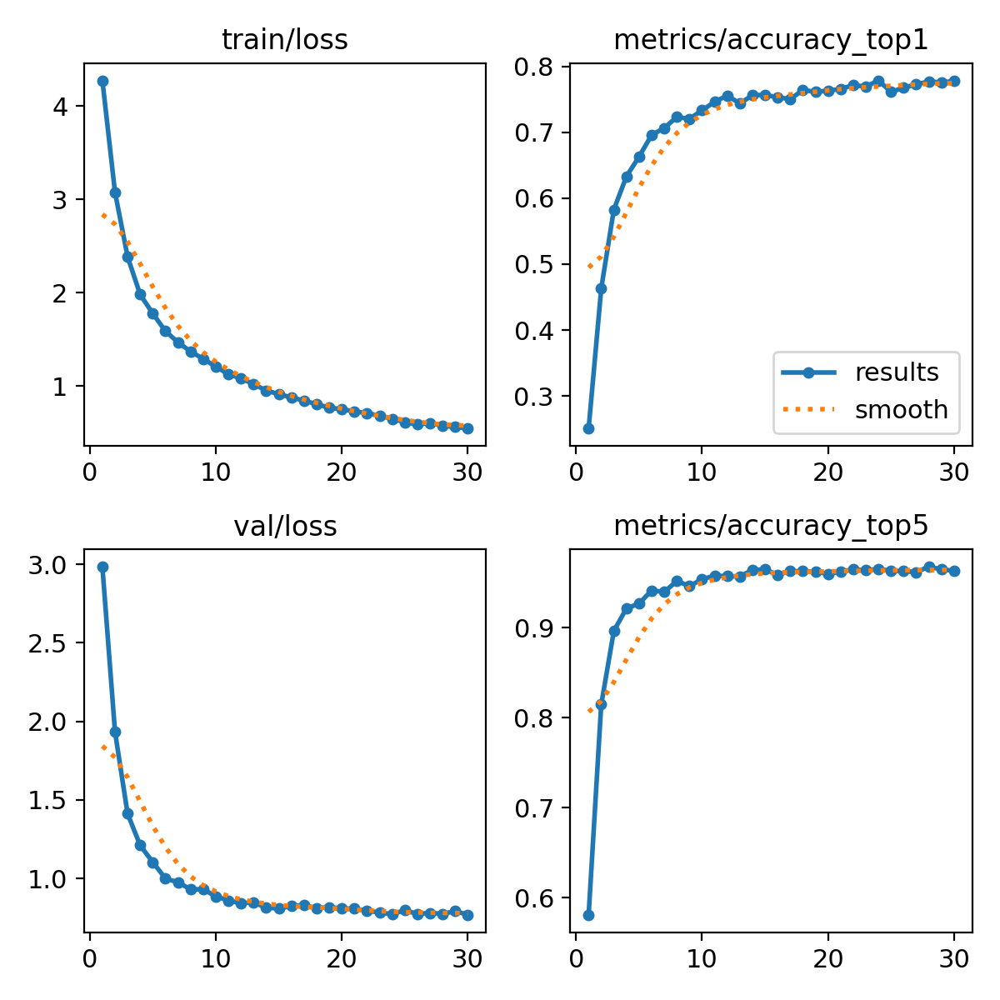

## 🧪 Classification Experementing with Three Types of Architectures 

|Model |Best accuracy| Note 
|-------|-------------|------|
|ConvNeXt-Tiny|	94% |	Strong baseline, fast to train 💪 [<u>Link to Repo</u>](https://github.com/Damoon-Vision-LLM/cv-convnext-cls)
YOLO11L (cv-yolo11-cls)|	78%	|Easy to implement, but accuracy is limited for this dataset 😢 [<u>Link to Repo</u>](https://github.com/Damoon-Vision-LLM/cv-yolo11-cls)
ResNet-50 (cv-resnet-cls)|	90%	|Classical baseline [<u>Link to Repo</u>](https://github.com/Damoon-Vision-LLM/cv-resnet-cls)
---

## 🐶 Dog Breed Classification with YOLO11

This project demonstrates an end-to-end workflow for dog-breed image classification using **YOLO11 (classification mode)** and **ConvNeXt**.  
It includes dataset setup, training, evaluation, and model experimentation.

---

## 🚀 Project Structure

```
project/
│── data/                      # Dataset folder (after downloading from Kaggle)
│── YOLO11_classification.ipynb  # Main training notebook
│── requirements.txt           # Python dependencies
│── README.md                  # Project documentation
└── model/                    # Orginal, beat, and last weights
```

---

## 📦 Installation

### 1️⃣ Install Dependencies

```bash
pip install -r requirements.txt
```

Recommended versions:
- Python 3.11+
- PyTorch (CPU/GPU/MPS compatible)
- Ultralytics >= 8.2.0
- Jupyter Notebook

---

## 📥 Download the Dataset

Download the **120 Dog Breed Dataset** from Kaggle:

🔗 https://www.kaggle.com/datasets/vikaschauhan734/120-dog-breed-image-classification

Place the unzipped folder into:

```
data/
```
---
Note: Yolo requirired a specefic data structure that can be found in YOLO/data
```
data/
├── train/
│   ├── breed_1/
│   │   ├── image_1.jpg
│   │   ├── image_2.jpg
│   │   └── ...
│   ├── breed_2/
│   │   ├── image_1.jpg
│   │   ├── image_2.jpg
│   │   └── ...
│   └── ...
└── val/
    ├── breed_1/
    │   ├── image_1.jpg
    │   ├── image_2.jpg
    │   └── ...
    ├── breed_2/
    │   ├── image_1.jpg
    │   ├── image_2.jpg
    │   └── ...
    └── ...
```
Note: We utelized **os.symlike** to creat virtual links (instead of copy pasting actual images)

## 🧪 Training the Model

Open the notebook:

```
YOLO11_classification.ipynb
```

Follow the steps to:

- Load and format the dataset
- Define training transformations
- Select backbone (YOLO11L, ConvNeXt, etc.)
- Train the model
- Visualize results

---

## 🧠 Model Experimentation Ideas

We experimented with several optimization strategies:
- Early or late layer freezing: Although a 10K-image dataset is relatively large, freezing the first few layers still proved beneficial.
- Data augmentation strategies (none, medium, max): These did not produce a significant improvement in accuracy.
- Learning rate schedules: Various schedules were tested.
- Image size experimentation (224px, 344px, etc.): Increasing the input size did not lead to better accuracy.

You can also skip training entirely and load the pretrained weights in model/weights/best.pt

---

## 📊 Results

Training run with the highest accuracy:
- Backbone **frozen**
- Trained **classification head**
- 224×224 images
- Mixup + CutMix used for augmentation
- Training prameter is in model/args.yaml

The model achieved a 78% top-1 accuracy and a 97% top-5 accuracy.
(Since many dog breeds are visually similar, even humans may need two or three guesses.)



---


